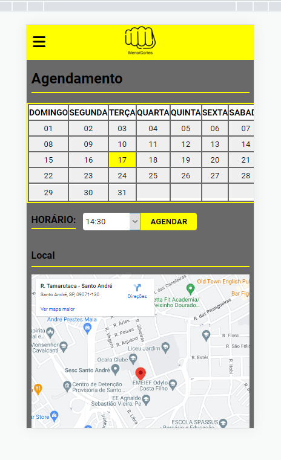

# Agendamento de barbearia

Este projeto tem o intuito de fazer o agendamento de uma barbearia (MenorCortes), neste projeto é possível definir uma data de agendamento e um horário, 
e assim conseguir realizar o agendamento do serviço. 

#### Objetivo

Este projeto tem um objetivo principal que é o agendamento de um horário junto ao barbeiro, que pode ser para fazer um dos serviços disponíveis da barberia como corte de
cabelo, penteado e barba

#### Decisão

O projeto veio de uma idéia real junto ao meu cabelereiro aonde ele já utiliza um sistema para agendamento de horário, porém o sistema não é customizado então neste 
projeto feito procurei adicionar os estilos de acordo com oque o mesmo me passou, como cores e ícones que foram apresentados pelo mesmo

